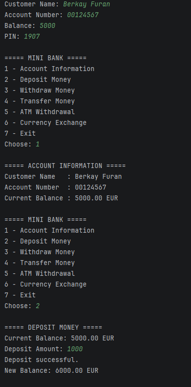
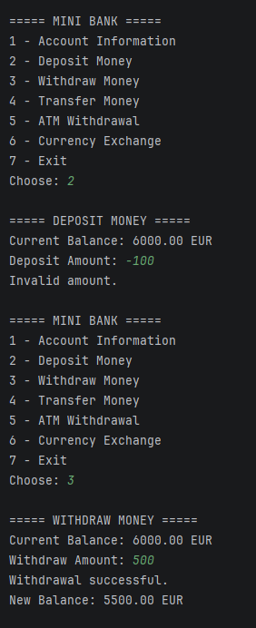
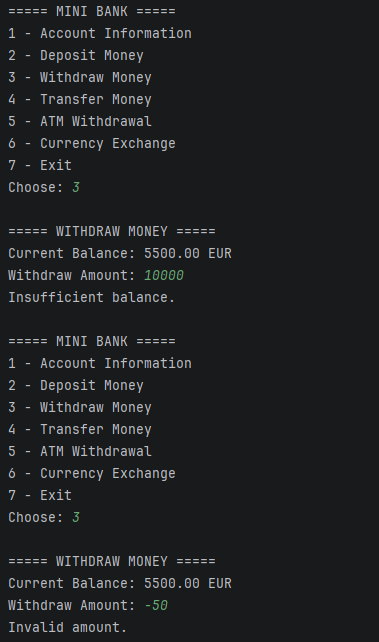
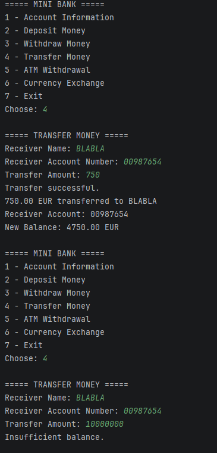
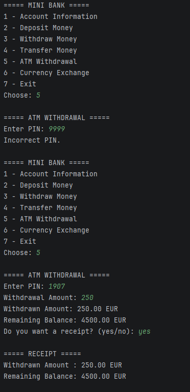
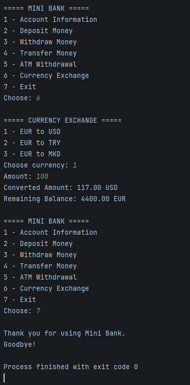

# Mini Bank System 

A simple Java console banking project built while learning Java fundamentals.

The project simulates basic banking operations such as deposits, withdrawals, money transfers, ATM withdrawals, and currency exchange.

## Features

- View account information
- Deposit money
- Withdraw money
- Transfer money to another account
- Balance validation
- ATM withdrawal with PIN verification
- Optional ATM receipt
- Currency exchange from EUR to USD, TRY, and MKD
- Invalid amount and insufficient balance checks
- Menu system with exit option

## Java Concepts Used

- Variables and data types
- Scanner for user input
- if / else if / else
- switch statements
- do-while loops
- Boolean values
- Logical operators
- String comparison with equals() and equalsIgnoreCase()
- Basic arithmetic operations
- String formatting

## Screenshots

### Account Information & Deposit

### Deposit Validation & Withdrawal

### Withdrawal Validation

### Money Transfer

### ATM Withdrawal & Receipt

### Currency Exchange & Exit

## Current Version

This is the first version of the project, created using the Java concepts I have learned so far.

The project will be improved as I continue learning Java.
